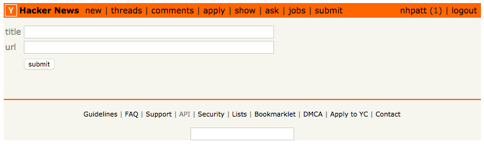

# angular2 @toledo

Material for a workshop explaining the main concepts of Angular 2.

The examples illustrate how to build a small clone of [Hacker News](https://news.ycombinator.com/) using angular2 as frontend and [launchpad from Liferay](http://liferay.io/) as the backend.

	
	

